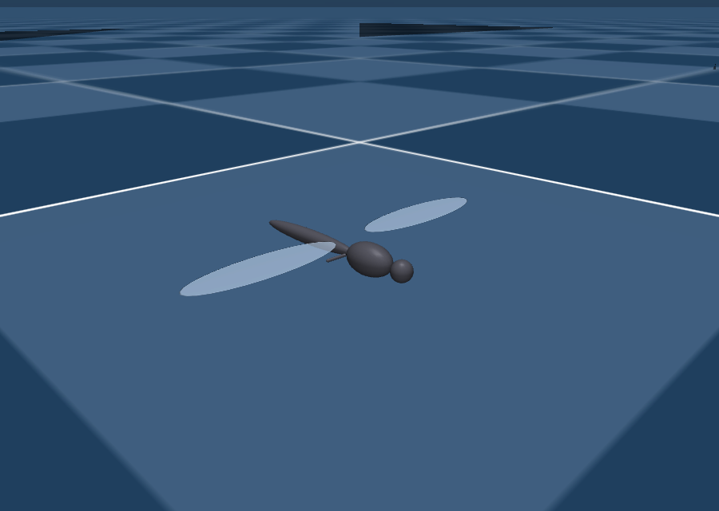
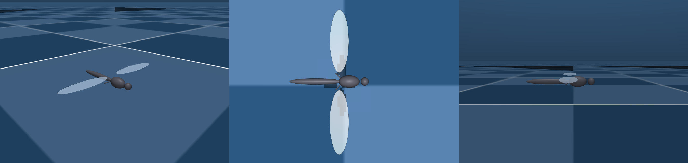

# flapping-flyer

**A simulated, bio-inspired flapping-wing micro air vehicle (FWMAV) that senses confined
spaces through its own aerodynamics — no lidar, no camera, no dedicated proximity
sensor — and uses that sense to hover, cruise, turn, and navigate winding, damaged
corridors purely by feel.**




---

## Table of contents

- [Summary](#summary)
- [Contribution](#contribution)
- [Inspired from](#inspired-from)
- [Simulation video](#simulation-video)
- [The flyer](#the-flyer)
- [What it can do, and how](#what-it-can-do-and-how)
- [Project structure](#project-structure)
- [Results](#results)
- [Analysis and discussion](#analysis-and-discussion)
- [Getting started / reproducing this work](#getting-started--reproducing-this-work)
- [Extending or leveraging this work](#extending-or-leveraging-this-work)
- [Conclusion](#conclusion)
- [References](#references)

---

## Summary

Quadrotors already solve open-air flight; they are poor at flying **through confined,
damaged spaces** (pipes, collapsed structures, containment vessels, greenhouses) because
their rotor downwash is strong enough to destroy the very flow signal a proximity sense
would need, and to stir up dust/contaminants in exactly the settings where that matters.
Flapping wings are different: their unsteady, low-downwash aerodynamics can plausibly be
*felt* rather than merely *used for thrust*.

This project builds, from first principles, a complete simulated flapping micro-flyer —
body, quasi-steady blade-element aerodynamics, free-flight rigid-body dynamics, an LQG
hover/cruise/turn controller — and then asks and answers one question: **can the flyer
sense nearby walls, floors, and openings using only the aerodynamic disturbance those
surfaces already induce on its own wings, read through its own flight-controller
residuals?** The answer, established through 48 numbered experiments, is yes — the
signal exists, is directional, is calibratable to sub-millimetre accuracy, is robust to
surface geometry and to the modelling uncertainty in its own strength, and is enough to
fly a full reactive mission (cruise, corner, centre, detect breaches, land) with no
vision, no GPS, and no learned policy.

**Objective.** Establish, in simulation, whether flow-proximity sensing — previously
demonstrated only on rotorcraft (Nakata et al. 2020) — is available to a flapping-wing
platform from its *own* wake, and whether classical control on that signal alone is
sufficient to navigate a realistic confined, winding, breached passage.

## Contribution

1. **A validated, from-first-principles flapping-flyer simulation stack** — mechanical
   body, three-term quasi-steady aerodynamics (translational, rotational/Kramer,
   added-mass), a from-scratch rigid-body free-flight integrator, and a from-scratch LQG
   controller (CARE/Kalman solved by hand, no `scipy` dependency) — each stage checked
   against a hand-predictable case before the next stage is built on it.
2. **A new sensing modality for flapping MAVs: proprioceptive flow-proximity sensing.**
   A nearby surface perturbs the induced flow at the wings; that perturbation appears as
   a small, directional wrench on the body; the flight controller's own disturbance
   observer isolates it from the wingbeat ripple and from the controller's own
   manoeuvring commands, yielding a **calibrated 3D proximity vector** (bearing in the
   horizontal plane + vertical range) — using zero additional hardware.
3. **A demonstration that the signal is trustworthy, not a modelling artefact**: it is
   robust to surface shape (flat wall, concave tunnel, convex pillar, tilted wall — all
   within ~1–2° of each other) and to a 4× uncertainty in the single physical constant
   (`K_GE`) the whole effect rests on — because that constant cancels out of the
   *direction* even though it sets the *range*.
4. **A full reactive navigation stack built only on that signal** (plus simple forward
   "antenna" feeler rays, itself framed as a stand-in for insect-like mechanosensing):
   cruise, corridor centering, stop-turn-go cornering, branch commitment, breach
   detection with a "don't get sucked out through the opening" veto, and an end-to-end
   inspection mission on a turning, variable-width, damaged containment passage —
   robustly graded against sensor noise and realistic (as low as 250 Hz) control rates.
5. **A candid account of every wrong turn** — two sign bugs, a spurious-torque
   simulation artefact mistaken for real instability, a filtering-vs-latency trap, and
   three separate control failures traced to *missing state*, not bad gains — kept in
   the `docs/` notebooks so the reasoning, not just the result, is reproducible.

## Inspired from

- **Biology.** Mosquitoes (*Aedes*/*Culex*): tiny, ~600 Hz wingbeat, low stroke
  amplitude, rotation-dominated lift — the aerodynamic regime this project's rotational
  (Kramer) lift term and its "aerodynamic imaging" framing are drawn from.
- **Hardware lineage.** The body is built at **Harvard RoboBee** scale (~77–82 mg,
  ~27 mm tip-to-tip) rather than true mosquito scale, deliberately trading biological
  fidelity for simulation-timestep sanity and comparability to the only insect-scale
  robots that have actually flown (RoboBee, RoboFly, KUBeetle, Purdue Hummingbird).
- **Key papers** the model, control, and sensing design are directly grounded in:
  Dickinson, Lehmann & Sane (1999); Sane & Dickinson (2002); Ellington (1984); Whitney &
  Wood (2010); Bomphrey et al. (2017); **Nakata et al. (2020)** — "Aerodynamic imaging
  by mosquitoes inspires a surface detector for autonomous flying vehicles" (the paper
  whose sensing idea this project ports from a quadrotor to a flapping wing — the
  central novelty gap this project targets); Tu, Fei, Zhang & Deng (2019) — first
  flapping robot to sense its environment through its own wings; Phan, Kang & Park
  (2017); Kang et al. (2024); Cai et al. (2025); Nekoo et al. (2025). Full citations in
  [References](#references) and at point of use in `docs/02_aerodynamics.md`.

## Simulation video

A recorded flight through a bent, sensed-only reactive course:

`outputs/view_reactive_course.webm`

Reproduce it (and every other clip below) yourself with the bundled viewers — each
opens the interactive MuJoCo viewer on the corresponding experiment:

```bash
python experiments/view_reactive_course.py   # reactive L/S-course flight, no memorized route
python experiments/view_hover.py             # LQG hover hold + disturbance rejection
python experiments/view_corridor.py          # corridor wall-centering
python experiments/view_corridor_mission.py  # full winding-corridor mission
python experiments/view_mission.py           # takeoff -> transit -> arrive -> land
python experiments/view_reactive_nav.py      # antenna + wing-wash reactive navigation
python experiments/view_full_simulation.py   # full stack, all systems engaged
python experiments/view_shaft.py             # vertical shaft / floor-following
```

MuJoCo's built-in viewer can record its own `.mp4`/`.webm` clips of any of these
sessions (screen-recorder or the viewer's capture button) if you want a fresh video.

## The flyer

RoboBee-class hovering flapping-wing micro air vehicle, defined entirely in
`models/flyer.xml` (geometry/mass/joints only — **MuJoCo has no built-in aerodynamics
model**; every aerodynamic force in this project is computed in Python and injected
each timestep).

| Quantity | Value |
|---|---|
| Total mass | 77.4 mg (RoboBee class; ~40× a real mosquito's ~2 mg) |
| Body length (nose to tail) | ~15.3 mm |
| Full wingspan, tip-to-tip | ~27 mm |
| Wing length `R` (hinge → tip) | 12–12.6 mm |
| Wing chord `c` | 3.5 mm (aspect ratio ≈ 3.43) |
| Wing thickness | 50 µm membrane |
| Centre of mass | ~1.2 mm below the wing-hinge plane (pendulum-stable by design) |
| Roll / pitch / yaw inertia | 1.71 / 6.04 / 7.31 ×10⁻¹⁰ kg·m² |
| Flap frequency (hover trim) | 80 Hz |
| Stroke amplitude (hover trim) | ±72.63° (bisected so cycle-avg lift = weight) |
| Feather (pitch) amplitude | ±45°, quarter-chord pitch axis |
| DOF | 2 hinges/wing (stroke + pitch), 6-DOF free body, 4 actuated joints |
| Actuators / control knobs | thrust (common stroke amp.), roll (differential amp.), pitch (differential offset), **yaw** (split-cycle stroke-phase distortion) |

**Dynamics, in brief.** Open-loop, the hovering flyer is *mildly* unstable: an unstable
oscillatory pitch mode (+4.33 ± 11.99j /s, ~1.9 Hz) and a faster unstable roll/lateral
mode (+15.98 /s, doubling ~43 ms), a neutral (uncontrollable but non-divergent) yaw, and
several stable, aerodynamically-damped modes. Left alone it tumbles and falls within
about a second; a designed LQG controller holds it to sub-degree attitude error and
recovers 30° kicks on a few percent of its control authority.

**What it can do.**
- Hover, hold altitude, and reject attitude/rate disturbances (LQG on an identified
  cycle-averaged linear model).
- Cruise at a commanded forward speed using an optic-flow analogue (its hover
  controller alone is blind to forward speed — a diagnosed and fixed limitation).
- Execute coordinated banked turns and sharp in-place stop-turn-go pivots.
- Generate yaw torque via split-cycle stroke timing and track a commanded heading.
- Sense a wall's bearing and range, a floor's clearance, and a corridor's centreline —
  from its own control-command residuals, with **no proximity sensor**.
- Centre itself in a corridor, follow a floor at a set clearance, take off and land
  (with a ground-effect-cushioned flare), and fly a full winding, breached, variable-
  width passage end-to-end while logging every breach it passes.

**How it does it (one sentence per layer).** A quasi-steady blade-element aerodynamics
model computes real forces from wing motion; a from-scratch rigid-body integrator
advances the body under those forces; an LQG controller (with a Kalman filter that
also carries dedicated *disturbance states*) holds attitude/height/velocity and, as a
side effect, its own innovations *are* the proximity signal; simple outer loops turn
that signal plus forward "antenna" feeler rays into cruise, centering, cornering, and
mission logic.

## Project structure

```
models/        MuJoCo XML bodies: flyer + generated course geometries (corridors,
                shafts, branching forks, breached containment passages)
src/           Reusable library code
  flyer.py       Rigid-body free-flight integrator + aero injection (the physics core)
  aero.py        Quasi-steady blade-element aerodynamics (3 force terms)
  kinematics.py  Prescribed wing-stroke kinematics + control-knob mixing
  ground_effect.py  Per-strip surface-proximity lift enhancement (floor/wall/tunnel/pillar)
  controller.py  LQG: CARE + Kalman solvers (hand-written, no scipy), disturbance
                 observer, trim, cruise/turn helpers
  sysid.py       Cycle-averaged linear system identification (A, B matrices)
  avoidance.py   Wall-standoff outer loop
  antenna.py     Forward feeler-ray "mechanosensing" model
  safety.py      Clearance / wingtip-strike checking
  noise.py       Sensor-noise model for realism sweeps
experiments/   48 numbered scripts (e00-e48), each a self-contained, runnable
               experiment + a handful of `view_*.py` interactive viewers
docs/          00-07: the lab notebooks — every design decision, wrong turn, and
               number defended, in the order the project was actually built
outputs/       Every experiment's CSV/NPZ data + PNG figure + the recorded flight clip
```

Each experiment file is self-documenting: read its module docstring first (`THEORY`,
`RESULT`, and often `HONEST CAVEAT`/`LIMITS` sections) before the code.

## Results

### Stage-by-stage validation (docs/00–07)

| Stage | Claim | Evidence |
|---|---|---|
| Aerodynamics | Lift ∝ f² (blade-element quasi-steady model) | 30→40 Hz lift ratio measured 1.78×, predicted (40/30)² = 1.78× |
| Free flight | Rigid-body rewrite removes a simulation artefact | old model tumbled <20 ms; corrected model holds few° over 400 ms |
| Open-loop dynamics | Honest instability is mild | pitch crosses 10° at 78 ms, roll at 126 ms, falls ~1 s |
| Control authority `B` | Near-diagonal, each knob drives its axis | cross-coupling ≤ 8% |
| Hover control (LQG) | Holds + recovers large kicks | 30°/30° kick → \|roll\|<0.4°, \|pitch\|<2.6°, ~11% control |
| Ground effect | Lift rise follows (R/4d)² | slope −2 on log-log, +11.7% weight at d=8mm down to +0.3% at 60mm |
| Wall effect | Directional roll torque, sign = side | +257 vs −257 µN·mm at ±y, usable to ~11 mm gap |
| Sensing in-loop | Control residual matches open-loop prediction | e.g. gap 4.7mm: measured u_roll −0.0370 vs predicted −0.0332 |
| Disturbance observer | Calibrated, sub-mm distance sensing | held-out RMSE 0.29 mm (wall), 0.03 mm (floor) |
| Corridor centering | Odd, zero-at-centre, no-calibration-needed signal | ±1347 (rad/s²) at ±2mm, ±8357 at ±8mm |
| Proximity compass (2D bearing) | Mean bearing error ~9° on a flat wall | robust to geometry (6–10° across wall/tunnel/pillar/tilt) and to 4× K_GE range |
| Forward cruise | Tracks commanded speed via optic flow | 0.05→0.064, 0.10→0.114, 0.15→0.164 m/s (~15% offset) |
| Lateral position loop | Sub-mm centreline hold while cruising | centres to ~0.2–0.3 mm over >1 m in a 32 mm-radius tube |
| Yaw actuator + heading loop | Controllable, trackable heading | ~49 rad/s²/unit authority; +30° command → 30.4° (0.4° error) |

### Reactive navigation & mission experiments (e31–e48)

These extend the validated sensing/control core into full navigation. Concrete figures
and numeric sweeps are saved per-experiment in `outputs/` (each has a matching `.png`,
several also a `.csv`); headline qualitative results:

| Experiment | Question | Outcome |
|---|---|---|
| e31 corner | Sharp stop-turn-go cornering | Pivot at ~0.6 rad/s, drift ~4 mm, new heading held <1° |
| e33/e34 corridor centering & mission | Centre using only the wing-wash signal | Recovers from ±10–12 mm offsets; full winding-corridor mission flown end-to-end |
| e35/e36 reactive navigation | Navigate with **no memorized route** (antenna + wing-wash only) | Rounds an L-bend and a full multi-segment reactive course purely by feel |
| e37 noise sweep | Survive realistic IMU/range sensor noise | Clearance-vs-noise curve reported across noise levels 0–3× realistic |
| e38 control-rate test | Survive a slow, realistic control loop | Course sweep from 10 kHz down to 250 Hz with zero-order hold |
| e39 branching | Commit to one of two unequal branches when centering signal goes quiet | Antenna feeler-steering takes over at the fork; commits cleanly |
| e40 side-gap | Resist being pulled through a one-sided wall opening (the "lurch") | Antenna-veto fusion identified as necessary to prevent the open-seeking lurch |
| e41/e42 wing-wash sensor characterization | Transfer function + observer fidelity/bandwidth of the wall sensor | Sensor gain and rise-time measured directly from the aero + observer models |
| e43 two-wall differential | Does the corridor signal superpose from two single-wall signals? | Net roll disturbance is zero at centre, superposes as predicted |
| e44 K_GE sensitivity | How much do conclusions move if the modelled surface-effect strength is off by 2×? | Centering signal scales ~linearly with K_GE; rate-robustness re-checked at 0.5×/1×/1.5× |
| e45 breach inspection | Detect, localize, and size wall openings while staying on route | With antenna-veto: flies past each breach and logs it; without veto: gets pulled out (mission fails) |
| e46 width floor | Narrowest corridor this airframe can fly | Measured completion + minimum wingtip clearance vs corridor width, at zero and realistic noise |
| e47/e48 realistic mission | Full turning, variable-width, breached containment passage | Combined trajectory + breach-detection map vs ground truth, scored with/without the veto fusion |

Figures: `outputs/arcA_summary.png` (the sensing arc), `outputs/arcB_summary.png` (the
navigation arc), `outputs/stage6_summary.png` (wall-avoidance loop),
`outputs/e45_breach_map.png`, `outputs/e47_layout.png`, `outputs/e48_mission_map.png`.

## Analysis and discussion

**What is genuinely established.** Given the project's *quasi-steady* aerodynamic model
(no explicit wake/induced-velocity term) plus a single, literature-grounded,
conservative surface-effect term (Cheeseman & Bennett 1955's `(R/4d)²` law, coefficient
`K_GE`), a hovering/cruising flapping flyer carries a real, directional, calibratable
proximity signal that a classical LQG controller's own disturbance observer already
extracts as a side effect of doing its job. That signal is provably robust to *surface
shape* and to a *4× uncertainty in K_GE itself* — because direction is a ratio of two
axes that both scale with K_GE, so it cancels; only range depends on the exact
constant. On top of that signal, plus simple forward feeler rays, a fully reactive
(no map, no memorized route beyond what "known confined route" experiments deliberately
assume) navigation stack flies a realistic, turning, variable-width, breached
containment-style passage.

**What is not established, and is said so throughout the docs.** The magnitude of the
surface effect is *added*, not *derived* from a wake-resolving aerodynamic model — this
is explicitly a **simulation feasibility** result, and `K_GE` is flagged as the number a
wind tunnel or CFD study would need to pin down before any hardware claim. A modelled
wall's lateral suction ("Coandă wall-suck") is omitted, meaning the real signal is
probably richer than modelled (a conservative bias, not an inflationary one). The
vertical sensing axis reports magnitude, not floor-vs-ceiling — a genuine sign
ambiguity requiring a second cue. Fore/aft sensing is ~11× weaker than lateral sensing
(a consequence of wing aspect ratio, and itself a design lever). Contact/compliance
recovery — plausibly a flapping-specific advantage — stays motivation, not a
demonstrated result, since the wings are rigid and no contact model exists. Several
control loops (violent-disturbance rejection near a wall, sharp 90° turns with altitude
coordination, tight <5 mm standoff regulation) are logged as open, tuning-level
problems layered on top of an already-solid sensing foundation.

**The recurring meta-lesson**, stated repeatedly in `docs/03` and worth generalizing:
almost every multi-session failure in this project was not a bad gain — it was a sign
error, a spurious numerical artefact mistaken for physics, or a controller being fed
the wrong (rippling, or maneuver-contaminated) signal. The fix was consistently to
*measure a smaller, isolated quantity* (an applied torque vs. the resulting
acceleration; a clean-plant probe of a single sign) rather than to keep re-tuning a
controller sitting on an unverified layer.

## Getting started / reproducing this work

### Requirements

- Python 3.10+ (developed and pinned against this)
- `mujoco==3.9.0`, `numpy>=1.26`, `matplotlib>=3.8` (see `requirements.txt`)

### Setup

```bash
git clone git@github.com:Ashfak-Kausik/flapping-flyer.git
cd flapping-flyer
python -m venv .venv
source .venv/bin/activate
pip install -r requirements.txt
```

### Verify the environment and the body model

```bash
python experiments/e00_hello_mujoco.py          # confirms MuJoCo works at all
python experiments/e01_load_model.py            # loads models/flyer.xml, prints mass/geometry
python experiments/e01_load_model.py --view      # opens the interactive viewer
```

### Walk the build in order

The experiments are numbered in the order the project was actually built, and each
depends conceptually on the ones before it. To reproduce the whole story:

```bash
for i in $(seq -w 0 48); do
  f=$(ls experiments/e${i}_*.py 2>/dev/null)
  [ -n "$f" ] && echo "=== $f ===" && python "$f"
done
```

In practice, jump to whichever layer you care about:

| You want to see... | Run |
|---|---|
| The aerodynamic model validated | `experiments/e02` through `e07` |
| Free flight + the LQG hover controller | `experiments/e08` through `e11` |
| The wall/floor sensing feasibility study | `experiments/e12`, `e13` |
| Sensing closed into a control loop | `experiments/e14` through `e17` |
| The calibrated 3D proximity vector | `experiments/e18` through `e21` |
| Cruise, centering, turning, heading control | `experiments/e22` through `e25` |
| The unified controller + integrated mission | `experiments/e29`, `e30` |
| Fully reactive (no memorized route) navigation | `experiments/e35`, `e36` |
| Robustness to noise / slow control loops | `experiments/e37`, `e38` |
| The realistic breached-containment mission | `experiments/e47`, `e48` |

Every experiment writes its numeric output (CSV/NPZ) and a figure (PNG) to `outputs/`,
so re-running one reproduces (and overwrites) the corresponding artifact used above.

### Read the reasoning, not just the code

The `docs/` folder is a set of lab notebooks, in build order, and is the fastest way to
understand *why* the code looks the way it does — including the dead ends. Start at
`docs/00_mechanical_design.md` and read through `docs/07_navigation.md`.

## Extending or leveraging this work

- **Calibrate `K_GE` against a real wind tunnel or CFD run.** It is the single knob
  (`src/ground_effect.py`) that separates this simulation-feasibility result from a
  hardware claim; everything else (directionality, robustness, control architecture)
  should transfer once it is pinned down.
- **Build the physical airframe.** `docs/00_mechanical_design.md` gives every
  dimension, mass, and joint needed to reproduce the body at RoboBee scale; `docs/00`
  §6 already flags what a real build needs that the simulation doesn't model (flexure
  hinges instead of ideal revolutes, a resonant piezo drive instead of position
  actuators, battery/controller/sensor mass not yet in the 77 mg budget).
- **Add wing compliance / contact recovery.** Flagged throughout as a plausible
  flapping-specific advantage over rotorcraft (brushing a wall without catastrophic
  failure) that is currently only motivation, since wings are rigid and no contact
  model exists — a natural next research axis.
- **Resolve the logged open control problems**: violent near-wall disturbance
  rejection, sharp 90° turns with altitude coordination, tight (<5 mm) standoff
  regulation, and vertical floor/ceiling disambiguation via a second cue — each is
  precisely scoped in `docs/05`–`docs/07` and the relevant experiment's docstring.
- **Swap in a different platform scale.** Every dimension in `models/flyer.xml` is
  parameterized and justified in `docs/01_body_model.md` §3 rather than hard-coded as a
  magic constant — moving toward true mosquito scale (or up to hawkmoth scale) is a
  deliberate, scoped experiment, not a rewrite.
- **Reuse the from-scratch LQG/CARE/Kalman solver** (`src/controller.py`) — it is a
  ~10-line, dependency-free (no `scipy`) Hamiltonian-eigenvector Riccati solver that
  matches `scipy.linalg.solve_continuous_are` to ~1e-9, useful in any constrained
  Python environment.
- **Extend the mission layer** (`experiments/e45`–`e48`) to new course geometries via
  `experiments/e47_realistic_course.py`'s leg/breach generator, without touching the
  sensing or control core.

## Conclusion

Starting from a bare MuJoCo body with no aerodynamics, this project builds — and at
every stage validates against a hand-predictable case — a complete flapping-wing flight
stack: aerodynamics, free-flight dynamics, hover/cruise/turn control, and finally a
sensing modality unavailable to rotorcraft: **feeling confined surroundings through the
flyer's own unsteady aerodynamics, read off its existing flight controller with no new
hardware.** That signal is shown to be real (within a stated, literature-grounded
model), directional, calibratable to sub-millimetre range, and robust to both surface
geometry and to substantial uncertainty in its own governing constant. Built on top of
it, a purely reactive controller — no map, no vision, no learning — flies a realistic,
turning, damaged, variable-width containment passage, detecting and logging breaches
along the way. The explicit boundary of the claim is equally important: this is a
simulation-feasibility result whose central physical constant needs experimental
calibration before it becomes a hardware claim — and the project says so at every
stage rather than only at the end.

## References

Full citations and in-context usage are in `docs/02_aerodynamics.md`; the core set:

- Dickinson, M.H., Lehmann, F.-O., Sane, S.P. (1999). Wing rotation and the aerodynamic
  basis of insect flight. *Science* 284, 1954–1960.
- Sane, S.P., Dickinson, M.H. (2002). The aerodynamic effects of wing rotation and a
  revised quasi-steady model of flapping flight. *J. Exp. Biol.* 205, 1087–1096.
- Sane, S.P. (2003). The aerodynamics of insect flight. *J. Exp. Biol.* 206, 4191–4208.
- Ellington, C.P. (1984). The aerodynamics of hovering insect flight (series). *Phil.
  Trans. R. Soc. Lond. B.*
- Whitney, J.P., Wood, R.J. (2010). Aeromechanics of passive rotation in flapping
  flight. *J. Fluid Mech.* 660, 197–220.
- Cheeseman, I.C., Bennett, W.E. (1955). The effect of ground on a helicopter rotor in
  forward flight. *ARC R&M 3021* — the `(R/4d)²` ground-effect law used throughout.
- Bomphrey, R.J., Nakata, T., Phillips, N., Walker, S.M. (2017). Smart wing rotation
  and trailing-edge vortices enable high frequency mosquito flight. *Nature* 544, 92–95.
- **Nakata, T., Phillips, N., Simões, P., Russell, I.J., Cheney, J.A., Walker, S.M.,
  Bomphrey, R.J. (2020). Aerodynamic imaging by mosquitoes inspires a surface detector
  for autonomous flying vehicles. *Science* 368, 634–637.** — the paper this project's
  central contribution ports from rotorcraft to a flapping wing.
- van Breugel, F., Riffell, J., Fairhall, A., Dickinson, M.H. (2015). Mosquitoes use
  vision to associate odor plumes with thermal targets. *Current Biology* 25(16), 2123–2129.
- Phan, H.V., Kang, T., Park, H.C. (2017). Design and stable flight of a 21 g
  insect-like tailless flapping wing micro air vehicle with angular rates feedback
  control. *Bioinspiration & Biomimetics* 12, 036006.
- Tu, Z., Fei, F., Zhang, J., Deng, X. (2019). Acting is seeing: Navigating tight space
  using flapping wings. *arXiv:1902.08688*.
- Kang, D. et al. (2024). Wing-strain-based flight control of flapping-wing drones
  through reinforcement learning. *Nature Machine Intelligence* 6, 992–1005.
- Cai, J., Sangli, V., Kim, M., Sreenath, K. (2025). Learning-based trajectory tracking
  for bird-inspired flapping-wing robots. *ACC 2025*.
- Nekoo, S.R., Rashad, R., De Wagter, C., Fuller, S.B., de Croon, G., Stramigioli, S.,
  Ollero, A. (2025). A review on flapping-wing robots: Recent progress and challenges.
  *The International Journal of Robotics Research* 44(14), 2305–2339.
